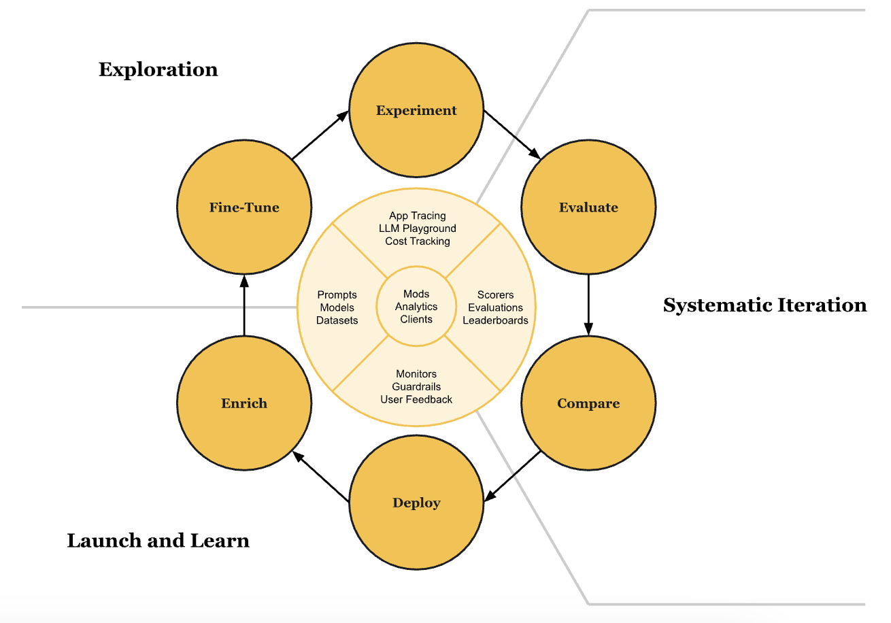

# Introduction to Weave

Weave is a tool for exploring, evaluating, and deploying LLM-based applications. Designed for flexibility and scalability, Weave supports every stage of the LLM workflow, from initial experimentation to systematic iteration and deployment.

The Weave workflow supports three major stages, organized as a loop:

1. [Exploration](#exploration): Experiment with prompts, pipelines, and initial test cases.
2. [Systematic Iteration](#systematic-iteration): Build evaluation datasets, compare models, and improve system performance.
3. [Launch and Learn](#launch-and-learn): Deploy applications, collect feedback, and iteratively refine.

Each stage includes specific substages that connect to core Weave features, as visualized in the diagram.

---

## Exploration

**Objective**: Early-stage experimentation to explore potential solutions and define tasks.

### Experiment
- **User Activities**: Experimenting with prompts and pipelines (e.g., Retrieval-Augmented Generation, or RAG).
- **Related Weave Features**: 
  - **App Tracing & Debugging**: 🟢 Lightweight tracing for quick insights.
  - **LLM Playground**: 🔵/🚧 Integrated environment for replayable experimentation.
  - **Cost Tracking**: 🟢 Understand and optimize resource usage.
- **Outcome**: Insights into initial LLM behaviors and problem framing.

### Fine-Tune
- **User Activities**: Fine-tuning frontier models with domain-specific data.
- **Related Weave Features**:
  - **Prompt Management & Versioning**: 🔵/🚧 Track and refine prompt iterations.
  - **Fine-Tune Tracking**: 💡 Monitor training improvements.
- **Outcome**: Models tailored to specific domains or applications.

---

## Systematic Iteration

**Objective**: Rigorous testing and evaluation to prepare for production.

### Evaluate
- **User Activities**: Building evaluation datasets and scoring methods.
- **Related Weave Features**:
  - **Evaluation Framework**: 🟢/📝 Code- and UI-based framework with intelligent caching.
  - **Built-in Scorers**: 🔵 Automated scoring for datasets.
- **Outcome**: Confidence in model accuracy and reliability.

### Compare
- **User Activities**: Comparing models and techniques.
- **Related Weave Features**:
  - **Model Management**: 🟢 Seamlessly organize and compare models.
  - **Model Comparison Reports**: 🟢 Visualize differences in performance.
  - **Leaderboards**: 🟢 Highlight top-performing approaches.
- **Outcome**: Clear selection of the best-performing configurations.

---

## Launch and Learn

**Objective**: Deploy LLM applications, collect feedback, and iterate.

### Deploy
- **User Activities**: Deploying the model/application.
- **Related Weave Features**:
  - **Production Tracing & Plotting**: 🟢 Monitor real-world behavior.
  - **Guardrails and Alerts**: 🚧 Proactively identify issues in production.
- **Outcome**: Applications ready for user interaction.

### Enrich
- **User Activities**: Collecting live user feedback and production data.
- **Related Weave Features**:
  - **Dataset Enrichment**: 🚧 Enhance evaluation datasets with production insights.
  - **User Feedback Collection**: 🟢 Record and analyze interactions.
- **Outcome**: Improved datasets and understanding of real-world use cases.

### Fine-Tune
- **User Activities**: Refining models based on production data.
- **Related Weave Features**:
  - **Fine-Tuning with Production Data**: 💡 Close the loop with improved performance.
- **Outcome**: Enhanced model accuracy and responsiveness.

---

## Cross-Stage Foundations

Weave includes foundational features that enhance every stage of the workflow:

- **Multi-Client Support**: 🟢 Python, TypeScript, HTTP APIs, and more.
- **Data Export**: 🟢 Export system data for external analysis.
- **Saved Views**: 🚧 Share analytics and evaluations.
- **Custom Mods**: 🚧 Build custom apps using Weave as a database.
- **W&B Integration**: 🚧 Connect model development with evaluations and workflows.

---

## Get started

Do the quickstart...

- Other pages that we want to link users to...
- Reference
- Cookbooks
- SDK
- ...